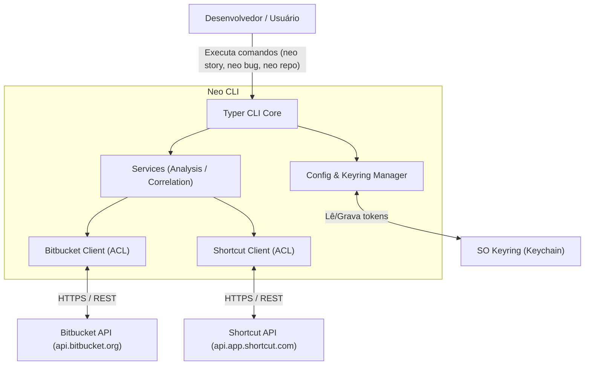
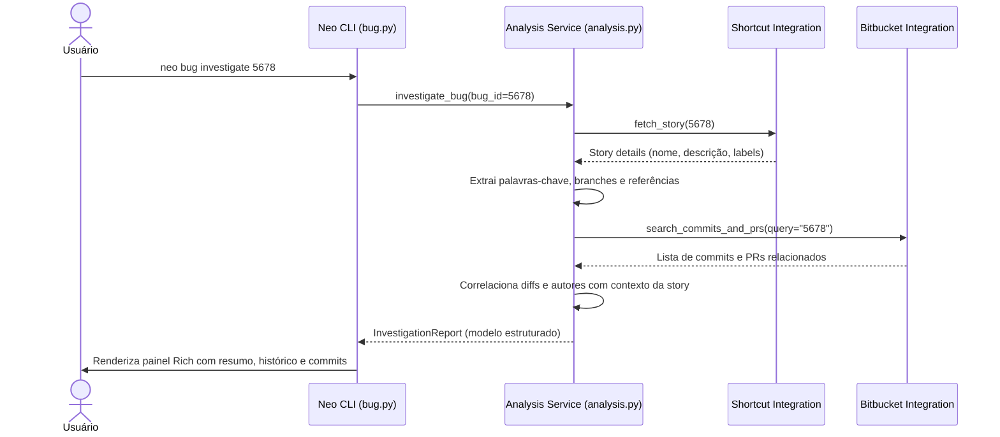

# Diagramas de Arquitetura — Neo

> Diagramas de arquitetura de alto nível em Mermaid.

## 1. Visão de Contexto do Sistema

```mermaid
flowchart TD
    User["Desenvolvedor / Usuário"]
    
    subgraph NeoSystem["Neo CLI"]
        CLI["Typer CLI Core"]
        Services["Services (Analysis / Correlation)"]
        Config["Config & Keyring Manager"]
        BB_Adapter["Bitbucket Client (ACL)"]
        SC_Adapter["Shortcut Client (ACL)"]
    end
    
    Bitbucket["Bitbucket API (api.bitbucket.org)"]
    Shortcut["Shortcut API (api.app.shortcut.com)"]
    OSKeyring["SO Keyring (Keychain)"]

    User -->|"Executa comandos (neo story, neo bug, neo repo)"| CLI
    CLI --> Services
    CLI --> Config
    Config <-->|"Lê/Grava tokens"| OSKeyring
    Services --> BB_Adapter
    Services --> SC_Adapter
    BB_Adapter <-->|"HTTPS / REST"| Bitbucket
    SC_Adapter <-->|"HTTPS / REST"| Shortcut
```

## 2. Fluxo da Investigação Cruzada (`neo bug investigate <id>`)

```mermaid
sequenceDiagram
    actor Dev as Usuário
    participant CLI as Neo CLI (bug.py)
    participant Svc as Analysis Service (analysis.py)
    participant SC as Shortcut Integration
    participant BB as Bitbucket Integration

    Dev->>CLI: neo bug investigate 5678
    CLI->>Svc: investigate_bug(bug_id=5678)
    Svc->>SC: fetch_story(5678)
    SC-->>Svc: Story details (nome, descrição, labels)
    Svc->>Svc: Extrai palavras-chave, branches e referências
    Svc->>BB: search_commits_and_prs(query="5678")
    BB-->>Svc: Lista de commits e PRs relacionados
    Svc->>Svc: Correlaciona diffs e autores com contexto da story
    Svc-->>CLI: InvestigationReport (modelo estruturado)
    CLI->>Dev: Renderiza painel Rich com resumo, histórico e commits
```
