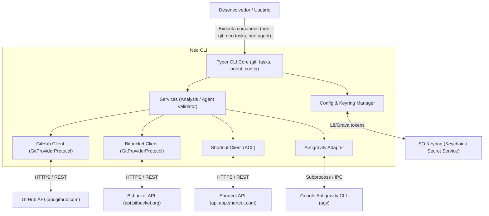
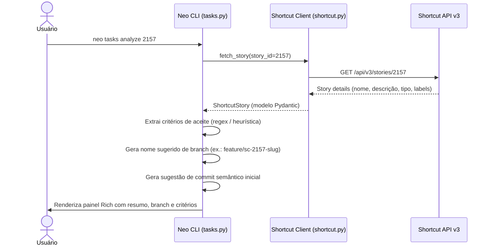

# Diagramas de Arquitetura — Neo

> Diagramas de arquitetura de alto nível em Mermaid.

## 1. Visão de Contexto do Sistema

```mermaid
flowchart TD
    User["Desenvolvedor / Usuário"]
    
    subgraph NeoSystem["Neo CLI"]
        CLI["Typer CLI Core (git, tasks, agent, config)"]
        Services["Services (Analysis / Agent Validator)"]
        Config["Config & Keyring Manager"]
        GH_Adapter["GitHub Client (GitProviderProtocol)"]
        BB_Adapter["Bitbucket Client (GitProviderProtocol)"]
        SC_Adapter["Shortcut Client (ACL)"]
        Agent_Adapter["Antigravity Adapter"]
    end
    
    GitHub["GitHub API (api.github.com)"]
    Bitbucket["Bitbucket API (api.bitbucket.org)"]
    Shortcut["Shortcut API (api.app.shortcut.com)"]
    AgyCLI["Google Antigravity CLI (agy)"]
    OSKeyring["SO Keyring (Keychain / Secret Service)"]

    User -->|"Executa comandos (neo git, neo tasks, neo agent)"| CLI
    CLI --> Services
    CLI --> Config
    Config <-->|"Lê/Grava tokens"| OSKeyring
    Services --> GH_Adapter
    Services --> BB_Adapter
    Services --> SC_Adapter
    Services --> Agent_Adapter
    GH_Adapter <-->|"HTTPS / REST"| GitHub
    BB_Adapter <-->|"HTTPS / REST"| Bitbucket
    SC_Adapter <-->|"HTTPS / REST"| Shortcut
    Agent_Adapter <-->|"Subprocess / IPC"| AgyCLI
```

## 2. Fluxo de Análise de Story (`neo tasks analyze <id>`)

```mermaid
sequenceDiagram
    actor Dev as Usuário
    participant CLI as Neo CLI (tasks.py)
    participant Svc as Shortcut Client (shortcut.py)
    participant API as Shortcut API v3

    Dev->>CLI: neo tasks analyze 2157
    CLI->>Svc: fetch_story(story_id=2157)
    Svc->>API: GET /api/v3/stories/2157
    API-->>Svc: Story details (nome, descrição, tipo, labels)
    Svc-->>CLI: ShortcutStory (modelo Pydantic)
    CLI->>CLI: Extrai critérios de aceite (regex / heurística)
    CLI->>CLI: Gera nome sugerido de branch (ex.: feature/sc-2157-slug)
    CLI->>CLI: Gera sugestão de commit semântico inicial
    CLI->>Dev: Renderiza painel Rich com resumo, branch e critérios
```
